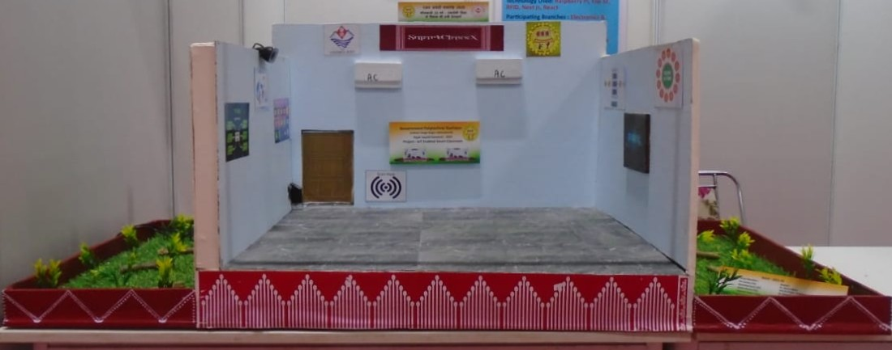

# 🧠 IOT ENABLED SMART CLASSROOM

## SmartClass X

We have developed a complete solution to transform traditional classrooms into **intelligent digital SmartClassrooms** using **IoT devices** and a **centralized web portal** built by our team.

Our goal is to provide a **fully automated, intelligent, and connected classroom environment** that enhances traditional teaching methods through:
- 🎯 **Smart Attendance System** using RFID and Fingerprint verification.  
- ⚙️ **Automated Device Control** (lights, fans, and smartboards) accroding to the presence of student in class.  
- 🧾 **Centralized Digital Management Portal** for attendance, lecture, and resource management.  
- 🔐 **Secure Access Control** ensuring only authorized students and teachers can enter or mark attendance.  
- 📊 **Data Logging & Analytics** to track class performance, student participation, and energy usage.  

---

## 🧩 Tech Stack Used

Our project integrates both **hardware** and **software** technologies for smooth IoT–Web interaction.

>- **__Scripting:__ Python**  
>   - **MicroPython (ESP32)** – to control sensors, RFID, and communication with backend.  
>   - **Python3 (Raspberry Pi)** – for automation hub and local data processing.  

>- **__Frontend:__ Next.js and React (Vite)**  
>   - Powering our **centralized web portal** for monitoring attendance, lectures, and smart resource management.  

>- **__Backend:__ Express.js and Flask (Fast)**  
>   - Used to handle **IoT communication**, **API endpoints**, **real-time data sync**, and **database integration**.  

---

## ⚡ Core Features

### 🔹 Smart Attendance Automation
- **RFID Enabled Entry Verification:** Automatically records attendance when a registered student or teacher taps their card.  
- **Fingerprint-Based Authentication:** Prevents proxy attendance and ensures accuracy.   

### 🔹 Intelligent Data & Management Portal
- **Centralized Dashboard:** Single web portal for attendance, resource management, and lecture management.  
- **Time-Based Event Notifications:** Alerts for upcoming lectures or maintenance schedules.  

### 🔹 Safety, Security, and Energy Efficiency
- **Authorized Access:** Only valid student or teacher IDs are accepted for classroom access.  
- **Power Efficiency:** Lights and fans turn off when no one is present.  
- **Data Storage & Logs:** Attendance and environmental data are stored for analytics.  

---

## 🧱 Hardware Components

| Component | Quantity | Function |
|------------|-----------|-----------|
| ESP32 Devkit V1 | 2 | IoT microcontrollers for local sensor nodes |
| Raspberry Pi 4 | 1 | Central controller and local web server |
| RFID Scanner + Cards | 1 + 4 | Entry verification and attendance |
| Fingerprint Sensor | 1 | Identity authentication |
| DC Gear Motor | 2 | Prototype automation demonstration |
| Breadboard + Jumper Wires | — | Circuit integration and testing |

---

## 🧠 System Overview

### **How It Works**

1. Each student/teacher has a **registered RFID based ID cards**.  
2. When someone enters, the system **verifies the identity** and allows the person to enter the classroom.  
3. **The Controllers** activate lights/fans only when the first student enters the class.
4. **Attendence Marking** Fingerprint Based attendence marking that can be reviewed by student/teacher on our web portal.  
5. All collected data is **stored on under the direct supervision of adminstrator** and then displayed on the **web portal**.  
6. The **web portal** provides access to attendance, lecture recording, and resource materials.

---

## 🧰 Prototype Project

  

### 🖥️ Demonstrated Capabilities
- **RFID-based Entry System**
- **Fingerprint Verification**
- **Automated Light & Fan Control**
- **Web Portal Access for Students and Teachers**
- **Live Monitoring and Sensor Dashboard**

---

## 🚀 Future Enhancements
- Integration with **AI based study assistant** for students.  
- Expansion into **AI based summary** for recorded lecture.  
- Addition of **Mock Test support** with instant validation.  
- Development of a **mobile app** linked to the SmartClass X portal.
- Upgrade from fingerprint to **Face recognition based attendence system** in order to increase integrety.
- Enviormental managment in order to provide **Sutable learning enviroment to each student**.  

---

## 🏁 Conclusion

SmartClass X bridges the gap between **traditional classrooms** and **modern IoT-enabled learning environments**.  
By combining automation, artificial intelligence, and seamless digital management, this system ensures:
- Better efficiency for teachers  
- Enhanced learning for students  
- Smarter and sustainable use of resources  

> “SmartClass X isn’t just about automating a classroom — it’s about redefining how learning spaces think, respond, and evolve.”

